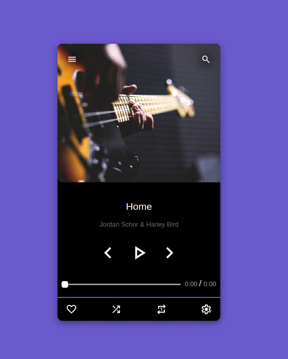
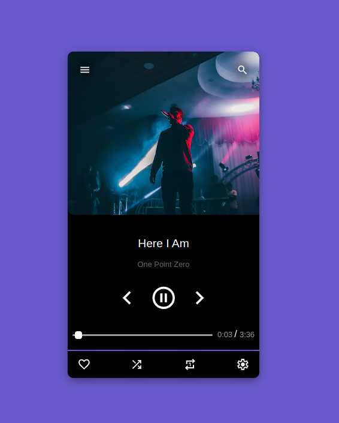
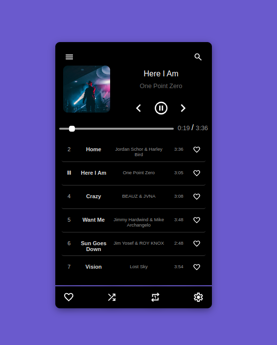
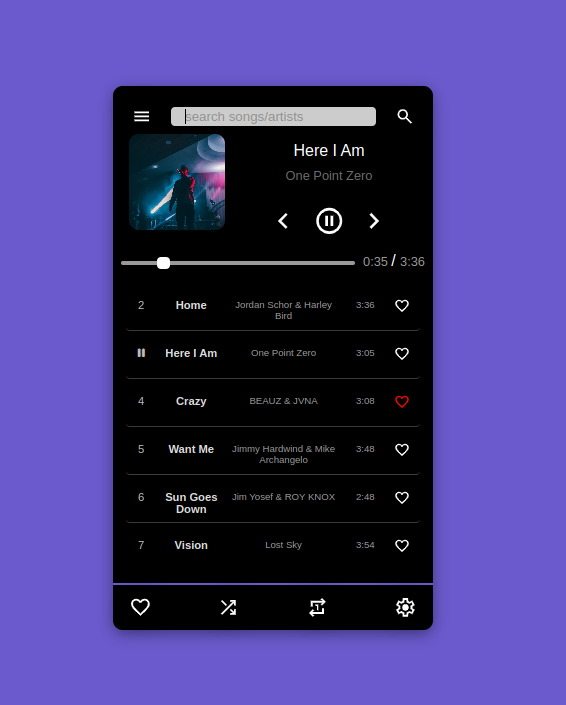

# 🎵 MusicApp  

🚀 A modern web application for discovering, playing, and managing music online.  

🔗 **Live Demo:** [MusicApp](https://durseltuerkan.github.io/musicApp/)  

## Features ✨  

- 🎶 **Play & Pause Music** – Stream songs directly in the app  
- 🔍 **Search for Songs** – Find music by title, artist, or album  
- 📌 **Favorite Songs** – Save tracks to a favorites list  
- 📋 **List & Single View** – View music in a list or focus on individual songs  
- 🔀 **Shuffle Songs** – Randomly shuffle songs for a fresh listening experience  
- 🎨 **Modern & Responsive UI** – Works smoothly on desktop and mobile  

## Screenshots 📸  
   
 
  
  

## Technologies Used 🛠️  

- **Frontend:** HTML5, CSS,Javascript, TypeScript  
- **Deployment:** GitHub Pages

  ## 👥 Team  

This project was developed by:

- **Dursel Türkan**  
- **Jing Li**  
- **Mame Angelique**

    ## Contact 📩  
For any inquiries or feedback, feel free to reach out:  

👤 **Dursel Türkan**  
- GitHub: [@durseltuerkan](https://github.com/durseltuerkan)  
- LinkedIn: [https://www.linkedin.com/in/dursel-tuerkan/](https://www.linkedin.com/in/dursel-tuerkan/) 
- Email: durselturkan@gmail.com 

